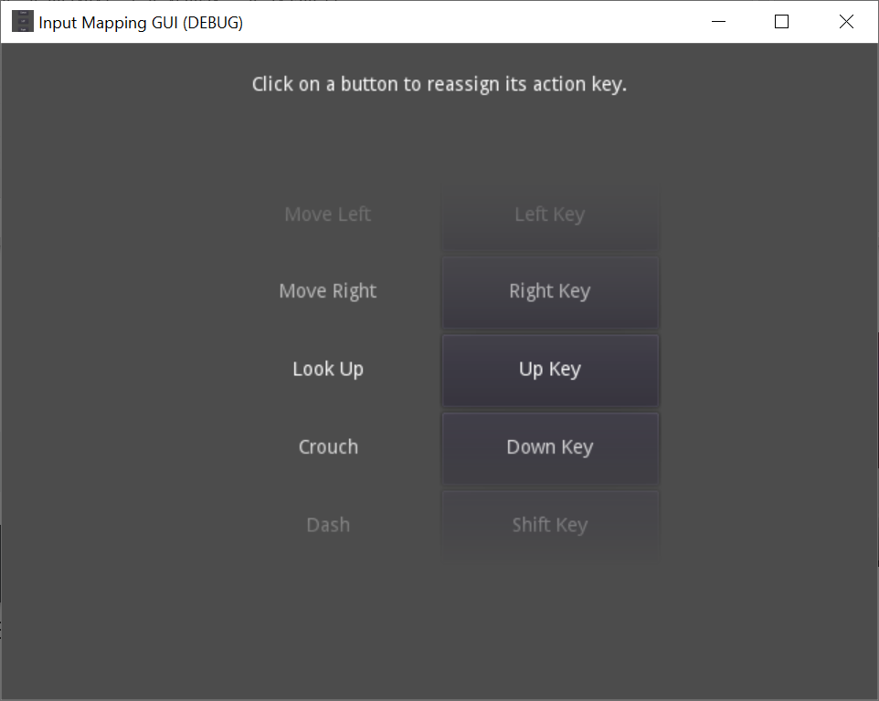
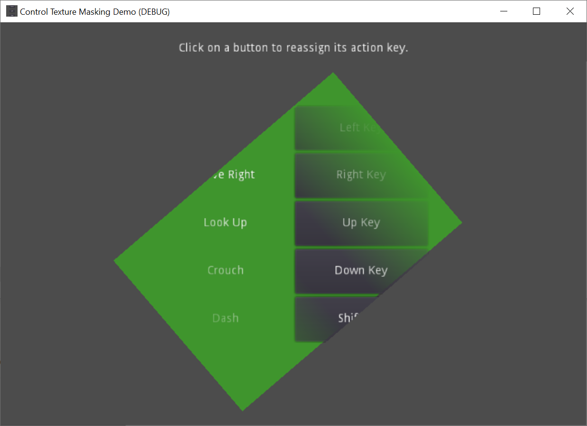

# Texture Masking Script and Shader

Texture masking allows one node to mask another node or set of nodes with a texture.

This is similar to a stencil, but does not actually restrict rendering.

**NOTE**: This effect **will not show in editor**. You must run to see the mask in effect.

To fix this limitation, this effect would have to be migrated to a tool script.

To use texture masking:

1. first create a `ShaderMaterial` (or multiple materials).
2. Assign **`MaskUI.shader`** to the `ShaderMaterial`, and set a mask texture in `Shader Params`.
3. Create a Control node over the area you want masked, and add **`MaskControl.gd`** as a script.
4. Add all `ShaderMaterial` you created into the `Materials` section of the `Script` params.
5. Assign the `ShaderMaterial` you created earlier to every Control or Sprite you wish to be masked.

An optimization to cull controls fully outside of the bounds of the mask should ideally be possib.e

However, due to a combination of a lack of geometry shaders, poor design in the Control
node implementation of mutating VERTEX position, rather than transform scale, and no easy way in 2D
to inject custom vertex data for this purpose, it is impossible to determine the size of the control.

This is an area may wish to continue exploring in the future.

Another feature to consider adding is an inverse mask: hiding within the rect instead of outside.

## (from demo project) GUI Input Mapping

A demo showing how to build an input key remapping screen.

- Click the buttons to change the bound keys.
- Persists the keys to disk, so they are preserved
  after the project is restarted.

Language: GDScript

Renderer: GLES 2

## Screenshots

